# CRM Specification Structure

このディレクトリ（`SPEC - Antigravity/`）には、Salesforce Sales Cloudと同等の機能を持つCRMアプリケーションの要件定義および設計ドキュメントを格納します。

## ディレクトリ構成

以下のような構成でドキュメントを整備しています。

```mermaid
graph TD
    SPEC[SPEC - Antigravity/] --> REQ[10_要件定義/]
    SPEC --> DESIGN[20_機能設計/]
    SPEC --> INT[30_インターフェース/]
    SPEC --> DRAFT[40_下書き・メモ/]

    REQ --> REQ0[01_用語集_v1.md]
    REQ --> REQ_S[02_スコープ_同等性マトリクス_v1.md]
    REQ --> REQ_P[03_業務プロセス定義_状態遷移_v1.md]
    REQ --> REQ1[11_ビジネス要件.md]
    REQ --> REQ2[12_機能要件.md]
    REQ --> REQ3[13_非機能要件.md]

    DESIGN --> DS0[01_ドメインERD_不変条件_v1.md]
    DESIGN --> DS1[02_データ辞書_v1.md]
    DESIGN --> DS2[03_権限_共有設計_v1.md]
    DESIGN --> DS3[04_自動化設計_v1.md]
    DESIGN --> DS4[05_画面仕様書_v1.md]
    DESIGN --> DS5[21_データモデル_スキーマ.md]
    DESIGN --> DS6[22_画面遷移図.md]
    DESIGN --> DS7[23_画面レイアウト定義.md]
    DESIGN --> DS8[24_ロジック_ビジネスルール.md]

    INT --> INT1[31_API定義_v1.md]
    INT --> INT2[32_サービス境界仕様書_v1.md]
    INT --> INT3[33_イベント仕様書_v1.md]
    INT --> INT2[32_サービス境界仕様書_v1.md]

    DRAFT --> DR1[最初のとっかかり.md]
```

## 各ファイルの内容

### 10_要件定義 (Requirements)
*   **[01_用語集_v1.md](file:///Users/kanekomasato/twenty/SPEC - Antigravity/10_要件定義/01_用語集_v1.md)**: プロジェクト全体で使用する正準用語の定義（**完全版：Canonical Glossary - 強化済み**）。営業ドメイン、商品・価格・見積、共有・権限、組織・テリトリ、監査・自動化、システム基盤の全用語を網羅。
*   **[02_スコープ_同等性マトリクス_v1.md](file:///Users/kanekomasato/twenty/SPEC - Antigravity/10_要件定義/02_スコープ_同等性マトリクス_v1.md)**: 実装スコープとSalesforceとの機能同等性基準（**完全版 - MoSCoW方式で強化済み**）。Must/Should/Could/Won't分類による包括的な品質保証基準とフェーズ別実装計画。
*   **[03_業務プロセス定義_状態遷移_v1.md](file:///Users/kanekomasato/twenty/SPEC - Antigravity/10_要件定義/03_業務プロセス定義_状態遷移_v1.md)**: 各オブジェクトの業務フローと詳細な状態遷移定義（**完全版 - 大幅強化済み**）。Lead/Opportunity/Activity/Quote/Order/Forecast/Territory管理の詳細なマトリクスとビジネスルール。
*   **[11_ビジネス要件.md](file:///Users/kanekomasato/twenty/SPEC - Antigravity/10_要件定義/11_ビジネス要件.md)**: プロジェクトの目的、ターゲットユーザー、解決したい課題。
*   **[12_機能要件.md](file:///Users/kanekomasato/twenty/SPEC - Antigravity/10_要件定義/12_機能要件.md)**: 実装すべき機能一覧。
*   **[13_非機能要件.md](file:///Users/kanekomasato/twenty/SPEC - Antigravity/10_要件定義/13_非機能要件.md)**: パフォーマンス、セキュリティ、可用性。

### 20_機能設計 (Functional Design)
*   **[01_ドメインERD_不変条件_v1.md](file:///Users/kanekomasato/twenty/SPEC - Antigravity/20_機能設計/01_ドメインERD_不変条件_v1.md)**: エンティティ境界、関係性、不変条件（**完全版 - 大幅拡張済み**）。Territory管理、Forecasting、詳細Sharing、監査・履歴、多態参照、パフォーマンス考慮を含む包括的ERDと70+の不変条件定義。
*   **[02_データ辞書_v1.md](file:///Users/kanekomasato/twenty/SPEC - Antigravity/20_機能設計/02_データ辞書_v1.md)**: 各オブジェクトの項目定義（**完全版 - Forecasting・Territory強化済み**）。全エンティティの詳細項目定義、インデックス戦略、履歴追跡対象、レポート利用可否を網羅。
*   **[03_権限_共有設計_v1.md](file:///Users/kanekomasato/twenty/SPEC - Antigravity/20_機能設計/03_権限_共有設計_v1.md)**: 権限・共有の評価アルゴリズムと仕様（完全版）。
*   **[04_自動化設計_v1.md](file:///Users/kanekomasato/twenty/SPEC - Antigravity/20_機能設計/04_自動化設計_v1.md)**: バリデーション、ワークフロー、承認フロー（完全版）。
*   **[05_画面仕様書_v1.md](file:///Users/kanekomasato/twenty/SPEC - Antigravity/20_機能設計/05_画面仕様書_v1.md)**: 画面構成、UIコンポーネント、オブジェクト別UX、設定画面（完全版）。
*   **[21_データモデル_スキーマ.md](file:///Users/kanekomasato/twenty/SPEC - Antigravity/20_機能設計/21_データモデル_スキーマ.md)**: 物理データモデルのドラフト。
*   **[22_画面遷移図.md](file:///Users/kanekomasato/twenty/SPEC - Antigravity/20_機能設計/22_画面遷移図.md)**: アプリ内のナビゲーション。
*   **[23_画面レイアウト定義.md](file:///Users/kanekomasato/twenty/SPEC - Antigravity/20_機能設計/23_画面レイアウト定義.md)**: 画面構成要素の設計指針。
*   **[24_ロジック_ビジネスルール.md](file:///Users/kanekomasato/twenty/SPEC - Antigravity/20_機能設計/24_ロジック_ビジネスルール.md)**: バリデーションや自動化のルール（初期ドラフト）。
*   **[25_物理DB設計_v1.md](file:///Users/kanekomasato/twenty/SPEC - Antigravity/20_機能設計/25_物理DB設計_v1.md)**: PostgreSQLを前提とした物理スキーマ、インデックス、共有判定、パーティショニング設計（完全版）。
*   **[26_アプリケーションアーキテクチャ設計_v1.md](file:///Users/kanekomasato/twenty/SPEC - Antigravity/20_機能設計/26_アプリケーションアーキテクチャ設計_v1.md)**: サービス境界、保存パイプラインの同期/非同期制御、イベント設計、キャッシュ戦略（完全版）。
*   **[27_Core内部モジュール設計_v1.md](file:///Users/kanekomasato/twenty/SPEC - Antigravity/20_機能設計/27_Core内部モジュール設計_v1.md)**: モジュラーモノリスとしての内部パッケージ構成、レイヤ、保存パイプライン実装、テスト境界の定義（完全版）。
*   **[28_権限評価_共有_詳細決定表_v1.md](file:///Users/kanekomasato/twenty/SPEC - Antigravity/20_機能設計/28_権限評価_共有_詳細決定表_v1.md)**: Object/Field/Recordレベルのアクセス制御アルゴリズム、決定表、キャッシュ戦略（完全版）。
*   **[29_バリデーション_ワークフロー_DSL仕様_v1.md](file:///Users/kanekomasato/twenty/SPEC - Antigravity/20_機能設計/29_バリデーション_ワークフロー_DSL仕様_v1.md)**: 条件式AST、評価エンジン順序、フィールド更新（BeforeSave）の詳細仕様（完全版）。
*   **[30_レポート_クエリエンジン仕様_v1.md](file:///Users/kanekomasato/twenty/SPEC - Antigravity/20_機能設計/30_レポート_クエリエンジン仕様_v1.md)**: クエリDSL、集計アルゴリズム、行レベル権限の適用戦略（完全版）。
*   **[31_エッジケース集_v1.md](file:///Users/kanekomasato/twenty/SPEC - Antigravity/20_機能設計/31_エッジケース集_v1.md)**: 競合更新、共有再計算、承認ロック、削除波及、イベント重複等の詳細挙動定義（完全版）。

### 30_インターフェース (Interface)
*   **[31_API定義_v1.md](file:///Users/kanekomasato/twenty/SPEC - Antigravity/30_インターフェース/31_API定義_v1.md)**: Metadata/CRUD/Query/Bulk/Approval等を含むプラットフォームAPI定義（完全版）。
*   **[32_サービス境界仕様書_v1.md](file:///Users/kanekomasato/twenty/SPEC - Antigravity/30_インターフェース/32_サービス境界仕様書_v1.md)**: 各サービス（Core, Sharing, Automation等）の責務・API・DB・依存関係の定義（完全版）。
*   **[33_イベント仕様書_v1.md](file:///Users/kanekomasato/twenty/SPEC - Antigravity/30_インターフェース/33_イベント仕様書_v1.md)**: ドメインイベント、連携イベント、ペイロード形式、冪等性、順序保証の定義（完全版）。

### 40_下書き・メモ (Drafts)
*   **[最初のとっかかり.md](file:///Users/kanekomasato/twenty/SPEC - Antigravity/最初のとっかかり.md)**: 初期仮説の記録。

---

## 整合性に関する重要事項

本ディレクトリ内の `_v1.md` が付記されたドキュメントは、**ユーザから提示された詳細仕様を省略なく反映した「正本」**です。実装およびテスト設計の際は、これらのドキュメントを唯一の真実のソースとして参照してください。

## 最新強化内容（2026-01-10更新）

ChatGPTの会話内容との照合に基づき、以下の主要ドキュメントを包括的に強化しました：

### ✅ 要件定義の強化
- **用語集**: 基本用語集から正準用語集（Canonical Glossary）へ大幅拡充。営業ドメイン全体（Lead/Account/Opportunity/Activity等）、商品・価格・見積、予測管理、テリトリ管理、共有・権限、監査・自動化、システム基盤の用語を体系化
- **スコープマトリクス**: 単純なMVP/Phase2分類から、MoSCoW方式（Must/Should/Could/Won't）による詳細な優先度評価と包括的受入基準へ変更。データ整合性、パフォーマンス、セキュリティ、可用性、ユーザビリティの総合品質基準を設定
- **業務プロセス定義**: 基本的なステータス記述から、詳細な状態遷移マトリクス、ビジネスルール、エラーハンドリング、不変条件参照を含む包括的なプロセス仕様に拡張

### ✅ 機能設計の強化
- **ドメインERD**: コア業務エンティティのみから、Territory管理、Forecasting、詳細Sharing、監査・履歴、多態参照を含む完全なERDに拡張。70+の不変条件と実装ガイドライン、パフォーマンス考慮事項を追加
- **データ辞書**: 基本オブジェクトから、ForecastPeriod、Forecast、ForecastItem、Quota、Territory、TerritoryRule、TerritoryAssignment、TerritoryMemberの詳細項目定義を追加。全項目にインデックス戦略、履歴追跡、レポート利用可否を明記

### 📋 カバレッジ
この強化により、Salesforce Sales Cloud同等のCRMシステムに必要な全主要機能領域を網羅：
- **営業管理**: Lead/Account/Contact/Opportunity/Activity管理
- **商品・価格**: Product/Pricebook/Quote/Order管理
- **予測**: 階層予測、調整機能、Quota管理
- **テリトリ**: 階層テリトリ、自動割当ルール、メンバー管理
- **セキュリティ**: OWD、共有ルール、FLS、Role階層
- **監査**: 項目履歴、イベントログ、完全なトレーサビリティ
- **自動化**: バリデーション、ワークフロー、承認プロセス
