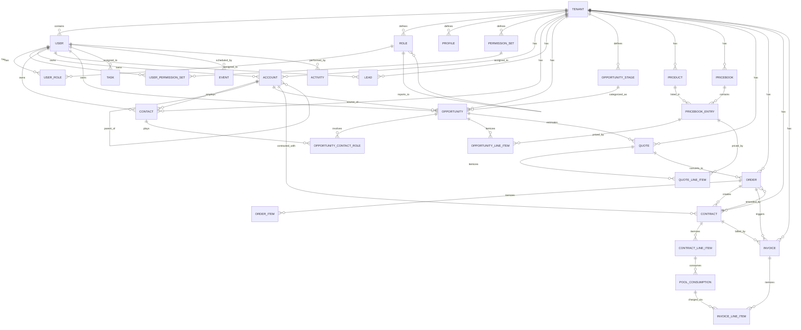

# ドメインERD・不変条件 v1

## 1. 包括的ドメインERD（全エンティティ）

### 1.1 コアドメインERD



### 1.2 拡張ドメインERD（予測・テリトリ・共有）

```mermaid
erDiagram
    %% テリトリ管理
    TENANT ||--o{ TERRITORY : "defines"
    TENANT ||--o{ TERRITORY_RULE : "configures"
    
    TERRITORY ||--o{ TERRITORY : "parent_of"
    TERRITORY ||--o{ TERRITORY_MEMBER : "includes"
    TERRITORY ||--o{ TERRITORY_ASSIGNMENT : "governs"
    TERRITORY_RULE ||--o{ TERRITORY_ASSIGNMENT : "triggers"
    
    USER ||--o{ TERRITORY_MEMBER : "participates_in"
    ACCOUNT ||--o{ TERRITORY_ASSIGNMENT : "assigned_via"
    
    %% 予測管理
    TENANT ||--o{ FORECAST_PERIOD : "defines"
    TENANT ||--o{ QUOTA : "sets"
    
    USER ||--o{ FORECAST : "submits"
    USER ||--o{ QUOTA : "assigned_to"
    FORECAST_PERIOD ||--o{ FORECAST : "covers"
    
    OPPORTUNITY ||--o{ FORECAST_ITEM : "contributes_to"
    FORECAST ||--o{ FORECAST_ITEM : "aggregates"
    
    %% 共有・権限
    TENANT ||--o{ SHARING_RULE : "defines"
    TENANT ||--o{ ORG_WIDE_DEFAULT : "configures"
    
    ACCOUNT ||--o{ ACCOUNT_SHARE : "shared_via"
    OPPORTUNITY ||--o{ OPPORTUNITY_SHARE : "shared_via"
    LEAD ||--o{ LEAD_SHARE : "shared_via"
    CONTACT ||--o{ CONTACT_SHARE : "shared_via"
    
    USER ||--o{ ACCOUNT_SHARE : "granted_to"
    USER ||--o{ OPPORTUNITY_SHARE : "granted_to"
    SHARING_RULE ||--o{ ACCOUNT_SHARE : "creates"
    
    %% チーム管理
    ACCOUNT ||--o{ ACCOUNT_TEAM_MEMBER : "shared_with"
    OPPORTUNITY ||--o{ OPPORTUNITY_TEAM_MEMBER : "shared_with"
    
    USER ||--o{ ACCOUNT_TEAM_MEMBER : "members"
    USER ||--o{ OPPORTUNITY_TEAM_MEMBER : "members"
    
    %% 監査・履歴
    TENANT ||--o{ FIELD_HISTORY : "tracks"
    TENANT ||--o{ EVENT_LOG : "audits"
    
    USER ||--o{ FIELD_HISTORY : "modified_by"
    USER ||--o{ EVENT_LOG : "performed_by"
```



## 2. 詳細エンティティ定義

### 2.1 ユーザ・組織管理（User & Organization）

#### 2.1.1 User（ユーザ）
```
核心属性:
- Id (Primary Key)
- TenantId (Tenant Key)
- Username (Unique per Tenant)
- Email, FirstName, LastName
- IsActive, IsDeleted
- ProfileId (Profile参照)
- RoleId (Role参照、任意)
- LastLoginDate, CreatedDate

認証・セッション:
- PasswordHash, Salt
- SessionToken, SessionExpiry  
- TwoFactorEnabled
- FailedLoginAttempts, LockedUntil

設定・個人化:
- TimeZone, Locale, Currency
- EmailNotificationSettings
- UIPreferences (JSON)
```

#### 2.1.2 Role（ロール階層）
```
階層管理:
- Id, TenantId
- Name, DeveloperName  
- ParentRoleId (自己参照、階層構成)
- RollupDescription

権限・機能:
- ForecastUserId (予測権限移譲)
- OpportunityAccessForAccountOwner
- CaseAccessForAccountOwner
```

#### 2.1.3 Profile（プロファイル）
```
基本情報:
- Id, TenantId
- Name, Description
- UserType ("Standard", "Admin", "Guest")

オブジェクト権限:
- AccountPermissions (JSON: Create,Read,Edit,Delete,ViewAll,ModifyAll)
- OpportunityPermissions (同上)
- LeadPermissions, ContactPermissions 等

システム権限:
- SystemPermissions (JSON: 各システム機能の可否)
- LoginIPRanges, LoginHours
- PasswordPolicies
```

### 2.2 営業ドメイン（Sales Domain）

#### 2.2.1 Account（取引先）
```
基本情報:
- Id, TenantId
- Name (必須)
- Type ("Customer", "Prospect", "Partner", "Other")
- Industry, AnnualRevenue, NumberOfEmployees
- Website, Phone, Fax

階層・関係:
- ParentAccountId (階層構造)
- AccountHierarchyLevel (計算項目)

住所・連絡先:
- BillingAddress (Street,City,State,PostalCode,Country)
- ShippingAddress (同上)

所有・権限:
- OwnerId (User参照)
- AccountTeamId (チーム管理)
- TerritoryId (テリトリ参照)

システム項目:
- CreatedDate, CreatedById
- LastModifiedDate, LastModifiedById
- SystemModstamp (楽観ロック)
- IsDeleted (論理削除)
```

#### 2.2.2 Contact（担当者）
```
個人情報:
- Id, TenantId
- AccountId (必須、Account参照)
- FirstName, LastName (LastName必須)
- Title, Department
- Email, Phone, MobilePhone
- Birthdate

営業関連:
- LeadSource
- DoNotCall, HasOptedOutOfEmail
- ContactLevel ("Primary", "Secondary", "Other")

住所:
- MailingAddress, OtherAddress

関係・所有:
- OwnerId, ReportsToId (Contact自己参照)

システム項目:
- CreatedDate, CreatedById
- LastModifiedDate, LastModifiedById 
- SystemModstamp, IsDeleted
```

#### 2.2.3 Lead（リード）
```
基本情報:
- Id, TenantId
- FirstName, LastName (LastName必須)
- Company (必須)
- Email, Phone, MobilePhone
- Title, Industry
- LeadSource, Status

評価・精査:
- Rating ("Hot", "Warm", "Cold")
- AnnualRevenue, NumberOfEmployees
- HasOptedOutOfEmail, DoNotCall

変換管理:
- IsConverted, ConvertedDate
- ConvertedAccountId, ConvertedContactId, ConvertedOpportunityId

不適格管理:
- IsUnqualified, UnqualifiedReason
- DisqualificationDate, DisqualificationReason

所有・住所:
- OwnerId
- Address (Street,City,State,PostalCode,Country)

システム項目:
- CreatedDate, CreatedById
- LastModifiedDate, LastModifiedById
- SystemModstamp, IsDeleted
```

#### 2.2.4 Opportunity（商談）
```
基本情報:
- Id, TenantId
- Name (必須)
- AccountId (必須、Account参照)
- Description

進捗管理:
- StageName (必須、OpportunityStage参照)
- Probability (0-100)
- CloseDate (必須)
- IsClosed, IsWon
- NextStep

金額・商品:
- Amount (必須)
- CurrencyIsoCode
- Pricebook2Id (標準価格表参照)
- HasOpportunityLineItems

予測・分析:
- ForecastCategory ("Omitted","Pipeline","BestCase","Commit","Closed")
- ForecastCategoryName
- ExpectedRevenue (Amount × Probability)

チーム・関係:
- OwnerId
- TerritoryId
- OpportunityTeamId

契約・更新関連:
- ContractId (既存Contract参照、Renewal/Upsell時)
- SourceOpportunityId (元商談参照、Renewal時)
- Type ("New", "Renewal", "Expansion", "Upsell", "Downsell")
- ContractType ("License", "PoF", "Service")
- BillingFrequency ("Monthly", "Yearly", "ThreeYear")
- TermMonths (契約期間・月数)

成約・失注:
- ActualCloseDate
- WinLossReason
- CompetitorName

システム項目:
- CreatedDate, CreatedById
- LastModifiedDate, LastModifiedById
- SystemModstamp, IsDeleted
```

### 2.3 テリトリ管理（Territory Management）

#### 2.3.1 Territory（テリトリ）
```
基本情報:
- Id, TenantId
- Name, DeveloperName
- Description
- ParentTerritoryId (階層構造)

権限・設定:
- ForecastEnabled
- AccessLevel ("Private", "Public")
- DefaultAccessLevel ("Read", "Edit", "All")

統計・KPI:
- AccountCount, OpportunityCount
- TotalRevenue, ForecastRevenue
- LastCalculatedDate

システム項目:
- IsActive
- CreatedDate, CreatedById
- LastModifiedDate, LastModifiedById
```

#### 2.3.2 TerritoryRule（テリトリルール）
```
基本情報:
- Id, TenantId
- TerritoryId (Territory参照)
- RuleName, Description
- IsActive, Priority

条件設定:
- BooleanFilter (例: "1 AND 2 OR 3")
- FilterCriteria (JSON: 複数条件の配列)

例: FilterCriteria構造
[
  {"field": "Industry", "operation": "equals", "value": "Technology"},
  {"field": "AnnualRevenue", "operation": "greaterThan", "value": 1000000},
  {"field": "BillingCountry", "operation": "equals", "value": "Japan"}
]

実行・監査:
- LastRunDate, NextRunDate
- ProcessedRecords, SuccessfulAssignments
```

#### 2.3.3 TerritoryAssignment（テリトリ割当）
```
基本情報:
- Id, TenantId  
- AccountId (Account参照)
- TerritoryId (Territory参照)
- AssignmentRuleId (TerritoryRule参照、任意)

割当管理:
- AssignmentType ("Automatic", "Manual")
- AssignedDate, AssignedById
- ReasonCode, ReasonDescription

有効期間:
- EffectiveDate, EndDate
- IsActive

システム項目:
- CreatedDate, CreatedById
- LastModifiedDate, LastModifiedById
```

#### 2.3.4 TerritoryMember（テリトリメンバー）
```
基本情報:
- Id, TenantId
- TerritoryId (Territory参照)
- UserId (User参照)

役割・権限:
- Role ("Owner", "Manager", "Member", "Viewer")
- AccessLevel ("Read", "Edit", "All")

有効期間:
- StartDate, EndDate
- IsActive

システム項目:
- CreatedDate, CreatedById
- LastModifiedDate, LastModifiedById
```

### 2.4 予測管理（Forecasting Management）

#### 2.4.1 ForecastPeriod（予測期間）
```
基本情報:
- Id, TenantId
- Name (例: "Q1 FY2024", "January 2024")
- PeriodType ("Monthly", "Quarterly", "Annual")

期間定義:
- StartDate, EndDate
- FiscalYear, FiscalQuarter, FiscalMonth

状態管理:
- Status ("Open", "Closed", "Locked")
- SubmissionDueDate
- ApprovalDueDate

システム項目:
- CreatedDate, CreatedById
- LastModifiedDate, LastModifiedById
```

#### 2.4.2 Forecast（予測）
```
基本情報:
- Id, TenantId
- ForecastPeriodId (ForecastPeriod参照)
- OwnerId (User参照、予測提出者)
- ManagerId (User参照、承認者)

予測値:
- PipelineAmount, BestCaseAmount
- CommitAmount, ClosedAmount
- AdjustmentAmount
- TotalForecastAmount (計算項目)

状態管理:
- Status ("Open", "Submitted", "Approved", "Revised", "Locked")
- SubmittedDate, ApprovedDate
- RevisionReason, ManagerNotes

集計メタデータ:
- OpportunityCount
- LastCalculatedDate
- SourceOpportunityIds (JSON配列)

システム項目:
- CreatedDate, CreatedById  
- LastModifiedDate, LastModifiedById
```

#### 2.4.3 ForecastItem（予測明細）
```
基本情報:
- Id, TenantId
- ForecastId (Forecast参照)
- OpportunityId (Opportunity参照)

スナップショット:
- Amount, Probability
- CloseDate, ForecastCategory
- StageName
- SnapshotDate (いつの時点での値か)

調整:
- AdjustmentAmount
- AdjustmentReason
- AdjustedBy, AdjustmentDate

システム項目:
- CreatedDate, CreatedById
- LastModifiedDate, LastModifiedById
```

#### 2.4.4 Quota（目標・クォータ）
```
基本情報:
- Id, TenantId
- OwnerId (User参照、目標設定対象者)
- QuotaName, Description

期間・目標:
- FiscalYear, FiscalQuarter, FiscalMonth
- QuotaAmount, Currency
- StartDate, EndDate

達成状況:
- ActualRevenue, ForecastRevenue  
- AttainmentPercentage (計算項目)
- LastCalculatedDate

階層管理:
- ParentQuotaId (ロール階層での積み上げ)
- IsRollupCalculated

システム項目:
- IsActive
- CreatedDate, CreatedById
- LastModifiedDate, LastModifiedById
```

### 2.5 共有・権限（Sharing & Security）

#### 2.5.1 OrganizationWideDefault（OWD：組織全体の設定）
```
基本情報:
- Id, TenantId
- ObjectType ("Account", "Contact", "Lead", "Opportunity")

アクセスレベル:
- DefaultAccessLevel ("Private", "Public", "ReadOnly", "ReadWrite")
- DefaultExternalAccessLevel (外部ユーザ向け)

特別設定:
- SharingModel ("Read", "ReadWrite", "FullAccess")
- ContactAccessLevel ("Private", "Controlled", "ReadWrite")

システム項目:
- LastModifiedDate, LastModifiedById
```

#### 2.5.2 SharingRule（共有ルール）
```
基本情報:
- Id, TenantId
- RuleName, Description
- ObjectType ("Account", "Contact", "Lead", "Opportunity")
- IsActive

条件設定:
- BooleanFilter
- FilterCriteria (JSON)

共有設定:
- SharedToType ("Role", "RoleAndSubordinates", "Group", "User")  
- SharedToId (共有先ID)
- AccessLevel ("Read", "Edit", "All")

実行管理:
- LastCalculatedDate
- RecordsAffected

システム項目:
- CreatedDate, CreatedById
- LastModifiedDate, LastModifiedById
```

#### 2.5.3 共有テーブル（AccountShare, OpportunityShare等）
```
AccountShare:
- Id, TenantId
- AccountId (Account参照)
- UserOrGroupId (共有先)

権限レベル:
- AccountAccessLevel ("Read", "Edit", "All")
- ContactAccessLevel ("Read", "Edit")
- OpportunityAccessLevel ("Read", "Edit")
- CaseAccessLevel ("Read", "Edit")

共有ソース:
- RowCause ("Owner", "Manual", "Rule", "Team", "Territory", "RoleHierarchy")
- SharingRuleId (SharingRule参照、ルール起因の場合)

有効期限:
- IsActive
- LastReferencedDate

システム項目:
- CreatedDate, CreatedById
- LastModifiedDate, LastModifiedById

※ OpportunityShare, LeadShare, ContactShare等も同様の構造
```

#### 2.5.4 チーム管理（AccountTeam, OpportunityTeam）
```
AccountTeamMember:
- Id, TenantId
- AccountId (Account参照)  
- UserId (User参照)

役割・権限:
- TeamMemberRole ("Account Manager", "Sales Rep", "Support Rep")
- AccountAccessLevel ("Read", "Edit")
- ContactAccessLevel ("Read", "Edit", "None")
- OpportunityAccessLevel ("Read", "Edit", "None")

システム項目:
- CreatedDate, CreatedById
- LastModifiedDate, LastModifiedById

※ OpportunityTeamMemberも同様、OpportunityId + 商談固有権限
```

### 2.6 監査・履歴（Audit & History）

#### 2.6.1 FieldHistory（項目履歴）
```
基本情報:
- Id, TenantId
- ParentId (対象レコードのId、多態参照)
- ParentType ("Account", "Opportunity", "Lead", "Contact")

変更内容:
- FieldName (変更された項目名)
- DataType ("String", "Number", "Date", "Boolean", "Picklist")
- OldValue, NewValue (JSON形式、複数データ型対応)

変更メタデータ:
- ChangeType ("Created", "Updated", "Deleted")
- IsSignificantChange (重要度フラグ)
- ChangeReason (変更理由、任意)

システム項目:
- ModifiedById (変更実行者)
- ModifiedDate (変更日時)
- SessionId (セッション追跡)
```

#### 2.6.2 EventLog（イベントログ）
```
基本情報:
- Id, TenantId
- EventType ("Login", "Logout", "RecordAccess", "ReportRun", "DataExport")
- EventCategory ("Security", "Data", "Configuration", "Performance")

イベント詳細:
- TargetId (対象レコードId、任意)
- TargetType (対象オブジェクトタイプ)
- EventDetails (JSON、イベント固有情報)

実行情報:
- UserId (実行者)
- SessionId (セッション)
- SourceIp, UserAgent

結果・パフォーマンス:
- ResultStatus ("Success", "Failed", "Warning")
- ErrorMessage
- ExecutionTimeMs
- RecordsProcessed

システム項目:
- EventDate (発生日時)
- CreatedDate
```

### 2.7 契約・請求管理（Contract & Billing）

#### 2.7.1 Contract（契約）
```
基本情報:
- Id, TenantId
- ContractNumber (一意、自動採番推奨)
- Name (契約名)
- AccountId (必須、契約先企業)

契約種別・状態:
- ContractType ("License", "PoF", "Service")
- Status ("Draft", "InApproval", "Activated", "Expired", "Terminated")
- AutoRenewal (自動更新フラグ)
- RenewalTermMonths (自動更新時の期間)
- RenewalNoticeDate (更新通知日)

期間:
- StartDate, EndDate (必須)
- TermMonths (契約期間・月数)
- BillingFrequency ("Monthly", "Yearly", "ThreeYear"、License時)

金額:
- TotalContractValue (契約総額、TCV)
- RemainingValue (残額、PoF時は消費に応じて減算)
- CurrencyIsoCode

関連:
- PrimaryOrderId (初回発注書)
- SourceContractId (更新元契約)
- OwnerId

ライフサイクル:
- ActivatedAt, ActivatedBy
- TerminatedAt, TerminationReason

システム項目:
- CreatedDate, CreatedById
- LastModifiedDate, LastModifiedById
- SystemModstamp, IsDeleted
```

#### 2.7.2 ContractLineItem（契約明細）
```
基本情報:
- Id, TenantId
- ContractId (必須、親Contract)
- ProductId (必須、商品)
- PricebookEntryId (価格表エントリ)
- SourceOrderItemId (元発注明細)

数量・価格:
- Quantity (数量)
- UnitPrice (標準単価)
- CustomerUnitPrice (顧客別単価、PoF用)
- TotalPrice (明細合計)

期間:
- TermMonths (契約期間)
- BillingFrequency
- StartDate, EndDate

消費追跡（PoF用）:
- ConsumedAmount (消費済み金額)
- RemainingAmount (残額 = TotalPrice - ConsumedAmount)
- Status ("Active", "Expired", "Cancelled")

その他:
- Description
- SortOrder

システム項目:
- CreatedDate, CreatedById
- LastModifiedDate, LastModifiedById
```

#### 2.7.3 PoolConsumption（プール消費）
```
基本情報:
- Id, TenantId
- ContractLineItemId (必須、対象PoF契約明細)

消費内容:
- ConsumptionDate (消費日)
- Quantity (消費数量)
- UnitPrice (適用単価: CustomerUnitPrice or UnitPrice)
- Amount (消費金額 = Quantity × UnitPrice)
- Description (消費内容説明)

承認管理:
- Status ("Pending", "Approved", "Rejected", "Cancelled")
- RequestedBy, RequestedAt
- ApprovedBy, ApprovedAt
- RejectionReason

請求連携:
- InvoiceLineItemId (請求明細)
- ExternalReference (外部システム参照、チケット番号等)

システム項目:
- CreatedDate, CreatedById
- LastModifiedDate, LastModifiedById
```

#### 2.7.4 Invoice（請求書）
```
基本情報:
- Id, TenantId
- InvoiceNumber (一意、自動採番推奨)
- AccountId (必須、請求先企業)
- ContractId (関連契約)
- OrderId (関連発注書)

日付:
- InvoiceDate (請求日)
- DueDate (支払期日)
- BillingPeriodStart, BillingPeriodEnd (請求対象期間)

金額:
- SubTotal (小計、明細合計)
- TaxAmount (税額)
- TotalAmount (合計 = SubTotal + TaxAmount)
- PaidAmount (支払済み金額)
- BalanceDue (残高 = TotalAmount - PaidAmount)
- CurrencyIsoCode

状態:
- Status ("Draft", "Sent", "Paid", "PartialPaid", "Overdue", "Cancelled", "Void")
- SentAt, PaidAt
- Notes (備考)

システム項目:
- CreatedDate, CreatedById
- LastModifiedDate, LastModifiedById
- SystemModstamp, IsDeleted
```

#### 2.7.5 InvoiceLineItem（請求明細）
```
基本情報:
- Id, TenantId
- InvoiceId (必須、親請求書)
- ProductId (必須、商品)

関連:
- ContractLineItemId (関連契約明細)
- OrderItemId (関連発注明細)
- PoolConsumptionId (関連プール消費、PoF用)

金額:
- Description (明細説明)
- Quantity (数量)
- UnitPrice (単価)
- Amount (金額 = Quantity × UnitPrice)
- TaxRate, TaxAmount (税率・税額)

期間:
- BillingPeriodStart, BillingPeriodEnd

表示:
- SortOrder

システム項目:
- CreatedDate, CreatedById
- LastModifiedDate, LastModifiedById
```

## 3. 多態参照（Polymorphic References）

### 3.1 Activity多態参照

#### 3.1.1 WhoId（人物参照）
```
対象オブジェクト: Lead, Contact
実装方式:
- WhoId: 18文字のSalesforce形式ID
- WhoType: オブジェクトタイプ ("Lead", "Contact")

制約・ルール:
- Lead.IsConverted = true の場合、新規紐付け不可
- Contact.IsDeleted = true の場合、参照無効
- 参照整合性チェック必須

データベース実装:
- WhoId varchar(18) not null
- WhoType varchar(20) not null  
- CHECK (WhoType IN ('Lead', 'Contact'))
- INDEX(WhoType, WhoId) -- 複合インデックス
```

#### 3.1.2 WhatId（対象参照）
```
対象オブジェクト: Account, Opportunity, Quote, Order, Campaign, Case
実装方式:
- WhatId: 18文字のSalesforce形式ID
- WhatType: オブジェクトタイプ

制約・ルール:
- 削除されたオブジェクトへの新規紐付け不可
- 関連性チェック（Contact.AccountId vs Opportunity.AccountId等）

データベース実装:
- WhatId varchar(18) null
- WhatType varchar(20) null
- CHECK (WhatType IN ('Account','Opportunity','Quote','Order','Campaign','Case'))
- INDEX(WhatType, WhatId)
```

### 3.2 添付・ノート多態参照

#### 3.2.1 Attachment/Note.ParentId
```
対象オブジェクト: 全主要オブジェクト
実装方式:
- ParentId: 参照先オブジェクトID
- ParentType: オブジェクトタイプ (computed)

ID Prefixによる型判定:
- Account: 001xxxxxxxxxxxxx
- Contact: 003xxxxxxxxxxxxx  
- Opportunity: 006xxxxxxxxxxxxx
- Lead: 00Qxxxxxxxxxxxxx
※ ID Prefixで動的にParentType判定
```

## 4. システム不変条件（Invariants）

### 4.1 テナント・セキュリティ（Tenant & Security）

```
INV-T1: マルチテナント隔離
- 全クエリは WHERE TenantId = :currentTenantId でフィルタ必須
- クロステナント参照は明示的権限が必要
- テナント削除時は全関連データの論理削除実行

INV-T2: ロール階層の非循環性  
- Role.ParentRoleId による循環参照禁止
- WITH RECURSIVE でチェック実装
- 最大階層深度: 10レベル

INV-T3: 権限継承の整合性
- 子ロールは親ロールの権限を継承
- プロファイル権限は最小公倍数的合成
- PermissionSet は追加権限のみ
```

### 4.2 営業ドメイン（Sales Domain）

```
INV-A1: 担当者の帰属必須
- Contact.AccountId ≠ null (必須)
- Account削除時は関連Contact処理の選択制御
- Account併合時はContact.AccountId一括更新

INV-A2: 取引先階層の非循環性
- Account.ParentAccountId による循環参照禁止  
- 階層深度制限: 最大5レベル
- 階層変更時の権限再計算必須

INV-L1: Lead変換の原子性
- Convert処理は全成功or全失敗 (トランザクション制御)
- IsConverted = true ⟺ Status = "Converted"
- Converted後のLead編集禁止

INV-L2: Lead不適格の整合性
- Status = "Disqualified" ⟹ DisqualificationReason ≠ null
- Status ≠ "Disqualified" ⟹ DisqualificationReason = null

INV-L3: 変換後Leadの活動制限
- Lead.IsConverted = true ⟹ 新規Task/Event作成不可（WhoId参照）
- 変換後Leadへの新規Activity.WhoId参照禁止
- 既存ActivityのWhoId参照は維持（履歴保全）
- 変換後Lead編集はシステム項目を除き不可

INV-O1: 商談帰属の必須性  
- Opportunity.AccountId ≠ null (必須)
- Account削除時は商談移行or削除の選択制御

INV-O2: ステージ整合性
- StageName は有効なOpportunityStageに存在必須
- Probability は対応Stageのデフォルト値に連動
- CustomStage追加時の既存データ整合性保持

INV-O3: 完了状態の整合性
- IsWon = true ⟹ IsClosed = true ∧ StageName = "Closed Won"
- IsClosed = true ⟹ StageName ∈ {"Closed Won", "Closed Lost"}
- 完了後の編集制限（管理者権限チェック）

INV-O4: 日付整合性
- CloseDate ≥ CreatedDate
- ActualCloseDate ≤ CURRENT_DATE
- 未来日付での成約禁止（ビジネスルール）

INV-O5: Closed Lost必須項目
- StageName = "Closed Lost" ⟹ LostReason ≠ null
- 失注理由のカテゴリ検証（定義済み選択肢のみ）
- 失注分析レポートの整合性保証

INV-O6: OpportunityContactRole唯一性
- Opportunity毎にIsPrimary=trueのContactRoleは最大1つ
- Primary変更時の排他制御
- 主要担当者不在時の警告（必須ではない）
```

### 4.3 商品・価格・見積（CPQ Domain）

```
INV-P1: 価格表整合性
- Product ⟷ Pricebook の多対多関係はPricebookEntryで管理
- PricebookEntry.UnitPrice ≥ 0
- Standard Pricebook必須、削除不可

INV-LI1: 商談明細の価格表一致
- OpportunityLineItem.PricebookEntryId の Pricebook2Id
  = Opportunity.Pricebook2Id
- 明細追加時の価格表整合性自動チェック

INV-LI2: 見積明細の価格表一致  
- QuoteLineItem.PricebookEntryId の Pricebook2Id
  = Quote.Pricebook2Id
- 価格表変更時は全明細の再検証必須

INV-LI3: 金額計算の整合性
- Opportunity.Amount = SUM(OpportunityLineItem.TotalPrice)
- Quote.GrandTotal = SUM(QuoteLineItem.TotalPrice) + Tax - Discount
- LineItem.TotalPrice = Quantity × UnitPrice × (1 - Discount)

INV-Q1: Primary Quote唯一性
- Opportunity毎にQuote.IsPrimary=true は最大1つ
- Primary Quote変更時の商談金額同期必須
- Primary Quote削除時の同期停止制御

INV-Q2: 見積有効期限
- Quote.ExpirationDate ≥ CreatedDate
- 期限切れ時の Status = "Expired" 自動更新
- 期限切れQuoteのPrimary指定解除

INV-Q3: 受注変換整合性
- Order変換可能: Quote.Status = "Accepted"
- 変換時のLineItem完全移行必須
- 元Quote の Status = "Ordered" 更新

INV-ORD1: Order状態遷移の整合性
- Status遷移順序: Draft → Activated → Fulfilled (or Cancelled)
- Activated後のLineItem変更禁止
- Fulfilled/Cancelled後の再活性化禁止
- Order.ActivatedDate はActivated時にのみ設定

INV-ORD2: Order金額整合性
- Order.TotalAmount = SUM(OrderItem.TotalPrice)
- OrderItem.TotalPrice = Quantity × UnitPrice × (1 - Discount)
- Activated後の金額変更禁止（管理者権限除く）

INV-ORD3: Order-Contract連携整合性
- Order.OrderType ∈ {"Renewal", "Upsell", "Downsell"} ⟹ Order.ContractId ≠ null
- Order.ContractId 指定時、Contract.AccountId = Order.AccountId
- Order.Activated時にContract生成/更新処理の原子性保証

INV-LI4: サブスクリプション金額計算の整合性
- License/Service: TotalPrice = UnitPrice × Quantity × (TermMonths / BillingPeriodMonths)
  - BillingPeriodMonths: Monthly=1, Yearly=12, ThreeYear=36
- PoF: TotalPrice = UnitPrice × Quantity（期間概念なし）

INV-LI5: サブスクリプション終了日計算の整合性
- EndDate = StartDate + TermMonths - 1日
  - 例: StartDate=2024/4/15, TermMonths=12 → EndDate=2025/4/14
- EndDate ≥ StartDate (必須)
- EndDate 計算はStartDateとTermMonthsから自動導出

INV-CON1: 契約帰属の必須性
- Contract.AccountId ≠ null (必須)
- Account削除時は契約移行or削除の選択制御
- Contract.AccountId と関連Order.AccountId の一致必須

INV-CON2: 契約種別の整合性
- ContractType は最初のContractLineItem.Product.ProductType から自動設定
- 異なるProductTypeの明細追加禁止（1契約1種別の原則）
- ContractType変更時の既存明細検証

INV-CON3: 契約終了日計算の整合性
- Contract.EndDate = Contract.StartDate + TermMonths - 1日
- 更新時は EndDate を延長（既存StartDateは変更不可）
- Renewal Order.Activated時にContract.EndDate自動更新

INV-CON4: 契約状態遷移の整合性
- Status遷移順序: Draft → InApproval → Activated → Expired/Terminated
- Activated後の基本項目変更禁止（管理者権限チェック）
- Terminated/Expired後の再活性化禁止
- Contract.ActivatedAt はActivated時にのみ設定

INV-CLI1: 顧客別単価の整合性
- ContractLineItem.CustomerUnitPrice 設定可否は
  PricebookEntry.AllowCustomerPrice = true の商品のみ
- CustomerUnitPrice設定時は PoolConsumption計算で優先使用

INV-CLI2: PoF残高の整合性
- PoF商品: ContractLineItem.RemainingAmount ≥ 0
- RemainingAmount = TotalPrice - ConsumedAmount
- ConsumedAmount > TotalPrice は禁止（残高不足エラー）

INV-PC1: プール消費承認時の残高チェック
- PoolConsumption.Status = "Approved" 時
  ContractLineItem.RemainingAmount ≥ PoolConsumption.Amount
- 残高不足の場合は承認不可（Rejected）

INV-PC2: プール消費対象の制限
- PoolConsumption は ContractLineItem.Product.ProductType = "PoF" のみ
- License/Service商品への消費登録禁止

INV-PC3: プール消費日の期間制限
- PoolConsumption.ConsumptionDate ∈ [Contract.StartDate, Contract.EndDate]
- 契約期間外の消費登録禁止
- 契約Expired/Terminated後の新規消費登録禁止

INV-INV1: 請求書金額整合性
- Invoice.SubTotal = SUM(InvoiceLineItem.Amount)
- Invoice.TotalAmount = SubTotal + TaxAmount
- Invoice.BalanceDue = TotalAmount - PaidAmount
- BalanceDue < 0 禁止（過払い防止）

INV-INV2: 請求書状態遷移の整合性
- Status遷移順序: Draft → Sent → Paid/PartialPaid/Overdue → Cancelled/Void
- Paid ⟹ BalanceDue = 0
- PartialPaid ⟹ 0 < BalanceDue < TotalAmount
- Void/Cancelled後の支払登録禁止

INV-INV3: 請求日の整合性
- Invoice.DueDate ≥ Invoice.InvoiceDate
- Invoice.BillingPeriodEnd ≥ Invoice.BillingPeriodStart
- License契約: Order.ActivatedDate ≤ InvoiceDate（発注後即時請求）
```

### 4.4 予測管理（Forecasting Domain）

```
INV-F1: 予測期間の整合性
- ForecastPeriod.StartDate < EndDate
- 期間重複の禁止 (同一PeriodType内)
- 過去期間の予測値変更制限

INV-F2: 予測値の計算整合性
- TotalForecastAmount = PipelineAmount + BestCaseAmount + CommitAmount
- ForecastItem集計とForecast.Amount の一致
- 調整値反映後の整合性保持

INV-F3: ロール階層予測の整合性
- 上位ロールは下位ロール予測の積上げ
- 調整値は直属部下のみ可能
- Quota との整合性追跡

INV-F4: 予測確定後の保護
- Status = "Locked" ⟹ 金額・明細変更禁止
- 確定後のOpportunity変更は次期予測に反映
- 確定予測の完全な監査ログ保持
```

### 4.5 テリトリ管理（Territory Domain）

```
INV-T1: テリトリ階層の非循環性
- Territory.ParentTerritoryId による循環参照禁止
- 階層深度制限: 最大5レベル  
- 階層変更時のメンバー権限再計算

INV-T2: テリトリ割当の整合性
- Account毎にTerritoryAssignmentは最大1つ(Active)
- 割当ルール評価の優先順位制御
- Manual割当時の自動割当無効化

INV-T3: テリトリメンバーの権限整合性
- Territory毎に最低1名のOwnerが必須
- 権限レベルの順序性: Owner > Manager > Member > Viewer
- User削除時の関連TerritoryMember自動削除

INV-T4: テリトリルールの整合性
- TerritoryRule.FilterCriteria の構文検証
- 参照項目の存在性チェック  
- ルール変更時の既存割当への影響評価
```

### 4.6 共有・権限（Sharing Domain）

```
INV-SH1: 共有評価の一貫性
- 全データアクセス経路（UI/API/Report）で同一の共有ロジック適用
- キャッシュと実共有権限の同期保証
- 共有権限変更時の即座反映

INV-SH2: 共有レコードの整合性
- *Share テーブルのレコードは有効な共有ソース由来のみ
- 孤立共有レコード（Orphan Records）の禁止
- RowCause の適切な設定必須

INV-SH3: OWD設定の整合性  
- OrganizationWideDefault の AccessLevel 順序性保持
- Private ≤ ReadOnly ≤ ReadWrite ≤ FullAccess
- 設定変更時の既存共有への影響評価

INV-SH4: チーム共有の整合性
- AccountTeam/OpportunityTeam メンバーへの自動Share作成
- Team解散時のShare削除の連鎖制御
- 権限レベル変更時のShare更新
```

### 4.7 監査・履歴（Audit Domain）

```
INV-AUD1: 項目履歴の完全性
- 追跡対象項目の変更は100%記録必須
- OldValue/NewValue の正確性保証
- 履歴の改ざん防止（Immutable Records）

INV-AUD2: イベントログの整合性
- 重要ビジネスイベントの完全記録
- ログの時系列順序性保証
- ログレベル別の保持期間管理

INV-AUD3: 削除追跡の整合性
- 論理削除（IsDeleted=true）の一貫適用
- 物理削除前のグレースピリオド保証
- 削除復旧時の関連データ整合性保持
```

### 4.8 活動管理（Activity Domain）

```
INV-ACT1: Activity WhoId多態参照制約
- WhoType ∈ {"Lead", "Contact"} のみ許可
- WhoId は同一Tenant内の有効なLead/Contact参照必須
- Lead.IsConverted = true の場合、新規WhoId紐付け禁止
- Contact.IsDeleted = true の場合、新規WhoId紐付け禁止

INV-ACT2: Activity WhatId多態参照制約
- WhatType ∈ {"Account", "Opportunity", "Quote", "Order", "Campaign", "Case"} のみ許可
- WhatId は同一Tenant内の有効なオブジェクト参照必須
- 参照先IsDeleted = true の場合、新規WhatId紐付け禁止
- WhoIdがContactの場合、Contact.AccountId と What.AccountId の整合性推奨

INV-ACT3: Task完了状態の整合性
- Status = "Completed" ⟹ CompletedDate ≠ null
- CompletedDate ≤ CURRENT_DATE
- 完了後の再オープン時はCompletedDate = null にリセット

INV-ACT4: Event時間整合性
- StartDateTime < EndDateTime
- IsAllDayEvent = true の場合、時刻部分は無視
- 過去のEventは編集制限（設定による）
```

## 5. パフォーマンス・スケーラビリティ考慮事項

### 5.1 インデックス戦略
```
主要インデックス:
- TenantId + OwnerId (全主要オブジェクト)
- TenantId + CreatedDate (時系列検索)
- TenantId + LastModifiedDate (増分同期)

共有関連:
- *Share.UserOrGroupId + ObjectId
- Role階層パス用マテリアライズドビュー

多態参照:
- (WhoType, WhoId), (WhatType, WhatId)
- ParentType + ParentId (添付・履歴)
```

### 5.2 パーティショニング戦略
```
テーブルパーティショニング:
- FieldHistory: 年月単位パーティション
- EventLog: 年月単位パーティション  
- 大規模*ShareテーブルのTenantId分散

アーカイブ戦略:
- 古いFieldHistory の段階的アーカイブ
- 非活性Tenant データの分離保存
```

### 5.3 キャッシュ戦略
```
共有権限キャッシュ:
- Redis によるユーザ別アクセス可能ID リスト
- TTL: 15分、権限変更時の即座無効化

メタデータキャッシュ:
- Profile/Role/Territory 構造
- 頻繁参照マスタデータ (Stage, Territory Rule)
```

## 6. 実装ガイドライン

### 6.1 不変条件チェック実装
```sql
-- 例: INV-A2 取引先階層循環チェック
WITH RECURSIVE account_hierarchy AS (
  SELECT id, parent_account_id, 1 as level, ARRAY[id] as path
  FROM account 
  WHERE parent_account_id IS NULL AND tenant_id = ?
  
  UNION ALL
  
  SELECT a.id, a.parent_account_id, ah.level + 1, ah.path || a.id
  FROM account a
  JOIN account_hierarchy ah ON a.parent_account_id = ah.id
  WHERE NOT a.id = ANY(ah.path) AND ah.level < 5
)
SELECT COUNT(*) = 0 as is_valid 
FROM account 
WHERE parent_account_id = ? AND id = ANY(
  SELECT unnest(path) FROM account_hierarchy WHERE id = ?
);
```

### 6.2 トリガー実装パターン
```sql
-- 例: 商談完了時の必須項目チェック
CREATE OR REPLACE FUNCTION check_opportunity_closed()
RETURNS TRIGGER AS $$
BEGIN
    IF NEW.is_closed = true THEN
        -- INV-O3: 完了状態整合性チェック
        IF NEW.is_won = true AND NEW.stage_name != 'Closed Won' THEN
            RAISE EXCEPTION 'INV-O3 violation: Won opportunity must have stage Closed Won';
        END IF;
        
        IF NEW.is_won = false AND NEW.loss_reason IS NULL THEN
            RAISE EXCEPTION 'INV-O5 violation: Lost opportunity must have loss reason';
        END IF;
    END IF;
    
    RETURN NEW;
END;
$$ LANGUAGE plpgsql;
```

### 6.3 定期メンテナンス
```sql
-- 例: 孤立共有レコードのクリーンアップ
DELETE FROM account_share 
WHERE row_cause = 'Rule' 
AND sharing_rule_id NOT IN (SELECT id FROM sharing_rule WHERE is_active = true);

-- 例: 期限切れQuoteの自動ステータス更新  
UPDATE quote 
SET status = 'Expired', last_modified_date = CURRENT_TIMESTAMP
WHERE expiration_date < CURRENT_DATE 
AND status NOT IN ('Expired', 'Accepted', 'Ordered');
```

このERDと不変条件により、Salesforce Sales Cloud同等の包括的なCRMシステムの完全性が保証されます。