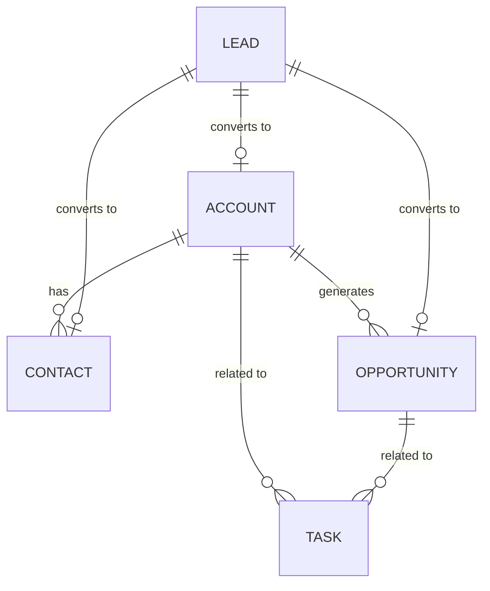

# 21_データモデル (Data Model)

## 1. エンティティ概要

| オブジェクト名 | 説明 | 主要フィールド |
| :--- | :--- | :--- |
| **Account** (取引先) | 会社・組織の基盤情報 | Name, Industry, BillingAddress, Phone |
| **Contact** (連絡先) | 個人・担当者の情報 | FirstName, LastName, Email, AccountId (FK) |
| **Lead** (リード) | 未評価の見込み客 | FirstName, LastName, Company, Email, Status |
| **Opportunity** (商談) | 売上・取引の情報 | Name, Amount, CloseDate, Stage, AccountId (FK) |
| **Task** (タスク) | 営業ToDo | Subject, DueDate, Status, RelatedTo (Polymorphic) |

## 2. リレーションシップ (Mermaid ER図)

## 3. フィールド詳細定義 (抜粋)

### Account (取引先)
*   `id`: UUID (Primary Key)
*   `name`: String (Not Null)
*   `industry`: Picklist (Technology, Finance, Manufacturing, etc.)
*   `website`: URL
*   `created_at`: Datetime

### Lead (リード)
*   `id`: UUID
*   `status`: Picklist (Open, Contacted, Qualified, Disqualified)
*   `source`: Picklist (Web, Referral, Event, etc.)
*   `is_converted`: Boolean (Default: False)
