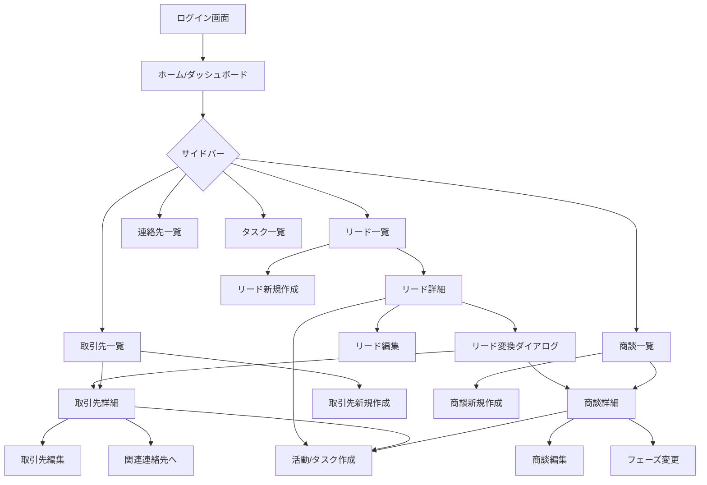

# 22_画面遷移図 (Screen Transition)

## 1. 概要
本CRMの主要な画面遷移をMermaid記法で定義します。
基本的にはサイドバーからのナビゲーションと、レコード一覧から詳細、編集画面への遷移が中心となります。

## 2. 画面遷移図

## 3. 主要遷移の説明

| 遷移元 | 遷移先 | 目的 |
| :--- | :--- | :--- |
| **リード詳細** | **リード変換** | 見込み客が成約に近づいた際、取引先・連絡先・商談へ情報を引き継ぐ。 |
| **一覧画面** | **詳細画面** | 特定のレコードの全フィールド情報および関連リストを確認する。 |
| **詳細画面** | **編集画面/モーダル** | 既存レコードの情報を更新する。 |
| **詳細画面** | **活動作成** | 電話やメール、ToDoなどのコンタクト履歴を残す。 |
